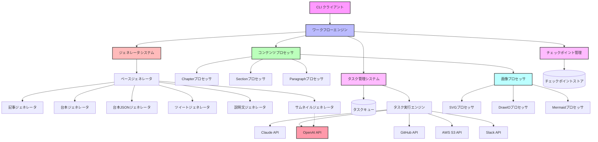
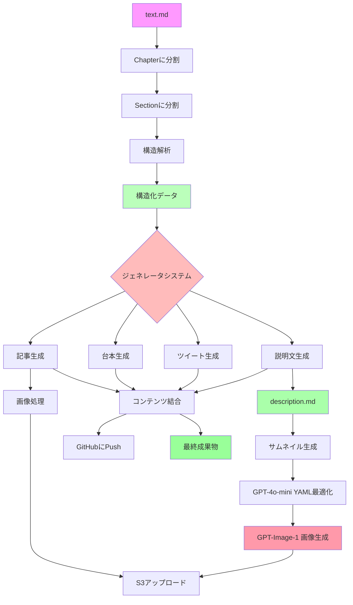
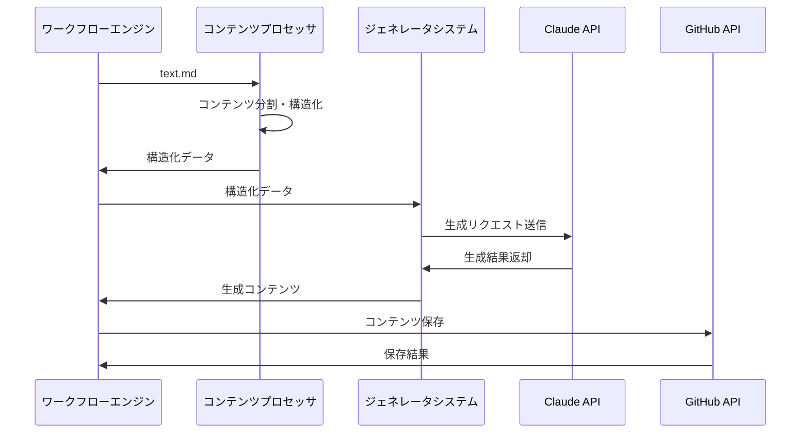

# リソース生成ワークフローのアーキテクチャ設計

## 1. システム概要

このシステムは、Markdown形式のテキストコンテンツ（`text.md`）を入力として、以下の処理を行うワークフローエンジンです：

1. コンテンツを章（Chapter）とセクション（Section）に分割
2. Claude APIを使用して各セクションの構造を解析
3. 記事（Article）、台本（Script）、ツイート（Tweets）などの派生コンテンツを生成
4. 画像処理（SVG、DrawIO XML、Mermaid図の変換と最適化）
5. OpenAI APIを使用したサムネイル画像の生成
6. 生成したリソースをGitHubにコミットしS3にアップロード
7. 処理の各段階でチェックポイントを保存し、中断時に再開可能な設計

このシステムはCLIとして実装され、バッチ処理や自動化パイプラインで利用できるよう設計されています。

## 2. システムアーキテクチャ

### 2.1 全体構成



### 2.2 主要コンポーネント

#### ワークフローエンジン
システム全体を制御し、実行フローを管理します。コンテンツプロセッサ、ジェネレータシステム、タスク管理システム、チェックポイント管理を連携させます。

#### タスク管理システム
非同期タスクの登録、実行、進捗管理を担当します。タスクキューを使用して処理を順序付けし、エラー発生時の再試行やスキップなどを制御します。

#### コンテンツプロセッサ
入力コンテンツの解析と変換を行います。Chapter、Section、Paragraphの各階層でコンテンツを構造化し、画像抽出などの基本処理を実行します。主に入力の「構造化」と「前処理」を担当します。

#### ジェネレータシステム
AIを活用したコンテンツ生成を行います。記事、台本、ツイートなどの様々な形式のコンテンツを、構造化された入力を基に生成します。「新規コンテンツの生成」に特化した責務を持ちます。

#### チェックポイント管理
処理状態を定期的に保存し、障害発生時や意図的な中断時に同じ状態から処理を再開できるようにします。

#### 画像プロセッサ
SVG、DrawIO XML、Mermaid記法で書かれた図をPNG形式に変換し、S3にアップロードします。

## 3. データフロー

### 3.1 入力から出力までの基本フロー



### 3.2 プロセッサとジェネレータの連携



### 3.3 ディレクトリ構造と成果物

処理の各段階で以下のようなディレクトリ構造が生成されます：

```
title/
├── chapter1/
│   ├── text.md
│   ├── section1/
│   │   ├── text.md
│   │   ├── section_structure.yaml
│   │   ├── article.md
│   │   ├── script.md
│   │   ├── script.json
│   │   ├── tweets.csv
│   │   └── images/
│   ├── section2/
│   │   └── ...
│   ├── text.md
│   ├── article.md
│   ├── script.md
│   ├── script.json
│   ├── tweets.csv
│   └── images/
├── chapter2/
│   └── ...
├── text.md
├── article.md
├── script.md
├── tweets.csv
├── structure.md
├── description.md
└── images/
└── thumbnail/
    └── ...
```

## 4. コンポーネント詳細設計

### 4.1 タスク管理システム

タスク管理システムは非同期タスクの登録、実行、監視、再試行などを担当します。

```python
class Task:
    """タスクの基本単位"""
    id: str                  # タスク識別子
    type: TaskType           # タスクのタイプ (API呼出し、ファイル操作、GitHub操作など)
    status: TaskStatus       # タスクの状態 (待機中、実行中、完了、失敗など)
    dependencies: List[str]  # 依存するタスクID
    retry_count: int         # 再試行回数
    params: Dict             # タスク実行パラメータ
    result: Any              # タスク実行結果
    
class TaskManager:
    """タスク管理システム"""
    
    def register_task(self, task: Task) -> str:
        """新しいタスクを登録"""
        pass
        
    def get_next_executable_task(self) -> Optional[Task]:
        """実行可能な次のタスクを取得"""
        pass
        
    def mark_as_completed(self, task_id: str, result: Any) -> None:
        """タスクを完了としてマーク"""
        pass
        
    def mark_as_failed(self, task_id: str, error: Exception) -> None:
        """タスクを失敗としてマーク"""
        pass
        
    def retry_task(self, task_id: str) -> None:
        """タスクの再試行"""
        pass
```

### 4.2 チェックポイント管理

チェックポイント管理は処理状態を定期的に保存し、中断時に再開可能にします。

```python
class Checkpoint:
    """チェックポイント情報"""
    id: str                      # チェックポイント識別子
    timestamp: datetime          # 保存時刻
    state: Dict                  # システム状態
    completed_tasks: List[str]   # 完了したタスクID
    pending_tasks: List[str]     # 保留中のタスクID
    
class CheckpointManager:
    """チェックポイント管理システム"""
    
    def save_checkpoint(self, checkpoint_type: str) -> str:
        """現在の状態をチェックポイントとして保存"""
        pass
        
    def load_latest_checkpoint(self) -> Optional[Checkpoint]:
        """最新のチェックポイントを読み込み"""
        pass
        
    def restore_from_checkpoint(self, checkpoint_id: str) -> None:
        """指定されたチェックポイントから状態を復元"""
        pass
```

### 4.3 コンテンツプロセッサ

コンテンツの解析と構造化を行います。生成機能はジェネレータに移行しました。

```python
class ContentProcessor:
    """コンテンツ処理システム"""
    
    def split_chapters(self, content: str) -> List[Chapter]:
        """コンテンツをチャプターに分割"""
        pass
        
    def split_sections(self, chapter_content: str) -> List[Section]:
        """チャプターコンテンツをセクションに分割"""
        pass
        
    def analyze_structure(self, section_content: str, images: List[Image] = None) -> Dict:
        """セクションの構造を解析"""
        pass
    
    def extract_metadata(self, content: str) -> Dict:
        """コンテンツからメタデータを抽出"""
        pass
        
    def combine_contents(self, contents: List[str], content_type: str) -> str:
        """複数のコンテンツを結合"""
        pass
```

### 4.4 ジェネレータシステム

AIを活用したコンテンツ生成を行います。

```python
class BaseGenerator:
    """ジェネレータの基底クラス"""
    
    def prepare_prompt(self, structure: Dict, additional_context: Dict = None) -> str:
        """プロンプトの準備"""
        pass
    
    def process_response(self, response: Dict) -> Any:
        """API応答の処理"""
        pass
    
    async def generate(self, input_data: Dict) -> Any:
        """コンテンツ生成の実行"""
        pass

class ArticleGenerator(BaseGenerator):
    """記事生成器"""
    
    def generate_article(self, structure: Dict, section_content: str) -> str:
        """構造情報から記事を生成"""
        pass

class ScriptGenerator(BaseGenerator):
    """台本生成器"""
    
    def generate_script(self, structure: Dict, article: str) -> str:
        """構造情報と記事から台本を生成"""
        pass

class ScriptJsonGenerator(BaseGenerator):
    """台本JSON生成器"""
    
    def generate_script_json(self, structure: Dict, script: str) -> Dict:
        """台本からJSON形式の台本を生成"""
        pass

class TweetGenerator(BaseGenerator):
    """ツイート生成器"""
    
    def generate_tweets(self, structure: Dict, article: str) -> List[str]:
        """構造情報と記事からツイートを生成"""
        pass

class DescriptionGenerator(BaseGenerator):
    """説明文生成器"""
    
    def generate_description(self, structure_md: str, article: str) -> str:
        """構造情報と記事から説明文を生成"""
        pass

class ThumbnailGenerator(BaseGenerator):
    """サムネイル生成器"""
    
    def generate_thumbnail(self, description_md: str) -> Dict:
        """説明文からサムネイル情報を生成"""
        pass
        
    def optimize_template(self, template: str, description: str) -> str:
        """GPT-4o-miniでテンプレートを最適化"""
        pass
        
    def generate_image(self, yaml_prompt: str) -> bytes:
        """OpenAI APIを使用して画像を生成"""
        pass
        
    def log_usage(self, usage_data: Dict) -> None:
        """API使用状況を記録"""
        pass
```

### 4.5 画像プロセッサ

画像の抽出、変換、最適化を行います。

```python
class ImageProcessor:
    """画像処理システム"""
    
    def extract_images(self, content: str) -> List[Image]:
        """コンテンツから画像を抽出"""
        pass
        
    def process_svg(self, svg_content: str) -> bytes:
        """SVGをPNGに変換"""
        pass
        
    def process_drawio(self, xml_content: str) -> bytes:
        """DrawIO XMLをPNGに変換"""
        pass
        
    def process_mermaid(self, mermaid_content: str) -> bytes:
        """Mermaid記法をPNGに変換"""
        pass
        
    def upload_to_s3(self, image_data: bytes, key: str) -> str:
        """画像をS3にアップロード"""
        pass
        
    def replace_image_links(self, content: str, image_map: Dict[str, str]) -> str:
        """コンテンツ内の画像参照を公開URLに置換"""
        pass
```

## 5. 外部API連携

### 5.1 Claude API連携

Claude APIを使用してコンテンツの解析や生成を行います。

```python
class ClaudeAPIClient:
    """Claude API連携クライアント"""
    
    def prepare_request(self, prompt: str, images: List[bytes] = None) -> Dict:
        """リクエスト準備"""
        pass
        
    async def call_api(self, request: Dict) -> Dict:
        """API呼び出し実行"""
        pass
        
    def extract_content(self, response: Dict, content_type: str) -> str:
        """レスポンスから特定タイプのコンテンツを抽出"""
        pass
```

#### 5.1.1 プロンプト構造

Claude APIへのリクエストでは、2種類のプロンプトを適切に組み合わせて利用します：

1. **システムプロンプト（System Prompts）**
   - AI応答の基本的な動作や制約を設定
   - 一貫した出力形式や品質を確保
   - モデル全体の振る舞いを制御

2. **メッセージプロンプト（Message Prompts）**
   - 具体的な指示内容と出力要求を記述
   - タスク固有の詳細な処理手順を提供
   - 出力フォーマットの詳細を指定

これらのプロンプトを適切に組み合わせることで、高品質で一貫性のあるコンテンツ生成を実現します。

### 5.2 OpenAI API連携

OpenAI APIを使用してサムネイル画像の生成を行います。

```python
class OpenAIClient:
    """OpenAI API連携クライアント"""
    
    def optimize_template(self, template: str, description: str) -> str:
        """GPT-4o-miniでYAMLテンプレートを最適化"""
        pass
        
    def generate_image(self, yaml_prompt: str, quality: str = "low") -> bytes:
        """GPT-Image-1で画像生成"""
        pass
        
    def log_usage(self, model: str, tokens: int, image_size: str, quality: str) -> None:
        """API使用状況を記録"""
        pass
```

### 5.3 GitHub API連携

GitHubリポジトリとの連携を行います。

```python
class GitHubClient:
    """GitHub API連携クライアント"""
    
    def push_file(self, path: str, content: str, message: str) -> str:
        """ファイルをGitHubにプッシュ"""
        pass
        
    def create_pr(self, title: str, description: str, branch: str) -> str:
        """プルリクエスト作成"""
        pass
```

### 5.4 AWS S3連携

画像やリソースをS3に保存します。

```python
class S3Client:
    """AWS S3連携クライアント"""
    
    def upload_file(self, data: bytes, key: str, content_type: str) -> str:
        """ファイルをS3にアップロード"""
        pass
        
    def get_public_url(self, key: str) -> str:
        """アップロードしたファイルの公開URL取得"""
        pass
```

### 5.5 Slack通知連携

処理状況をSlackで通知します。

```python
class SlackClient:
    """Slack通知クライアント"""
    
    def send_notification(self, message: str, attachments: List[Dict] = None) -> None:
        """通知送信"""
        pass
        
    def send_error_alert(self, error: str, context: Dict) -> None:
        """エラー通知送信"""
        pass
```

## 6. エラー処理と回復メカニズム

### 6.1 エラー処理戦略

システムは以下のエラー処理戦略を採用しています：

1. **一時的な障害**: 再試行ポリシーに基づいて自動再試行
2. **永続的な障害**: エラーログ記録、Slack通知、処理の安全な停止
3. **部分的な障害**: 影響を受けるタスクのみをスキップし、残りのタスクは継続実行

### 6.2 再開メカニズム

チェックポイントシステムにより、以下の再開機能を提供します：

1. 最新のチェックポイントから自動再開
2. 特定のチェックポイントを指定して再開
3. 失敗したタスクのみを再実行

## 7. パフォーマンスと拡張性

### 7.1 パフォーマンス最適化

1. **並行処理**: 独立したタスクの並行実行
2. **キャッシング**: API応答や中間生成物のキャッシュ
3. **バッチ処理**: 小さなI/O操作をバッチとしてまとめる

### 7.2 拡張性設計

1. **モジュラー設計**: 機能ごとの独立したモジュール
2. **プラグイン方式**: 新しい処理タイプやジェネレータの追加が容易
3. **設定駆動**: コード変更なしに動作変更が可能

## 8. ディレクトリ構成

```
resource-generate-workflow/
├── app/
│   ├── __init__.py
│   ├── cli.py                 # CLIエントリーポイント
│   ├── config.py              # 設定管理
│   ├── workflow/
│   │   ├── __init__.py
│   │   ├── engine.py          # ワークフローエンジン
│   │   ├── task_manager.py    # タスク管理
│   │   └── checkpoint.py      # チェックポイント管理
│   ├── processors/
│   │   ├── __init__.py
│   │   ├── content.py         # コンテンツ処理
│   │   ├── chapter.py         # チャプター処理
│   │   ├── section.py         # セクション処理
│   │   ├── paragraph.py       # パラグラフ処理
│   │   └── image.py           # 画像処理
│   ├── generators/
│   │   ├── __init__.py
│   │   ├── base.py           # 基底ジェネレータクラス
│   │   ├── article.py        # 記事生成器
│   │   ├── script.py         # 台本生成器
│   │   ├── script_json.py    # 台本JSON生成器
│   │   ├── tweet.py          # ツイート生成器
│   │   ├── description.py    # 説明文生成器
│   │   └── thumbnail.py      # サムネイル生成器
│   ├── clients/
│   │   ├── __init__.py
│   │   ├── claude.py          # Claude API連携
│   │   ├── openai.py          # OpenAI API連携
│   │   ├── github.py          # GitHub API連携
│   │   ├── s3.py              # AWS S3連携
│   │   └── slack.py           # Slack通知連携
│   └── utils/
│       ├── __init__.py
│       ├── markdown.py        # Markdown処理ユーティリティ
│       ├── file.py            # ファイル操作ユーティリティ
│       └── logger.py          # ロギングユーティリティ
├── tests/                     # テストコード
├── docs/                      # ドキュメント
│   ├── workflow.md            # ワークフロー図
│   └── architecture-design.md # アーキテクチャ設計図（本ドキュメント）
├── prompts/                   # Claude用プロンプトテンプレート
│   ├── system/                # システムプロンプト
│   │   ├── article.md         # 記事生成用システムプロンプト
│   │   ├── description.md     # 説明文生成用システムプロンプト
│   │   ├── image.md           # 画像処理用システムプロンプト
│   │   ├── script.md          # 台本生成用システムプロンプト
│   │   ├── script_json.md     # 台本JSON生成用システムプロンプト
│   │   ├── structure.md       # 構造解析用システムプロンプト
│   │   ├── thumbnail.md       # サムネイル生成用システムプロンプト
│   │   └── tweet.md           # ツイート生成用システムプロンプト
│   └── message/               # メッセージプロンプト
│       ├── article.md         # 記事生成用メッセージプロンプト
│       ├── description.md     # 説明文生成用メッセージプロンプト
│       ├── image.md           # 画像処理用メッセージプロンプト
│       ├── script.md          # 台本生成用メッセージプロンプト
│       ├── script_json.md     # 台本JSON生成用メッセージプロンプト
│       ├── structure.md       # 構造解析用メッセージプロンプト
│       ├── thumbnail.md       # サムネイル生成用メッセージプロンプト
│       └── tweet.md           # ツイート生成用メッセージプロンプト
├── templates/                 # 出力テンプレート
│   ├── thumbnail_template.yaml   # サムネイル用テンプレート
│   ├── description_template.md  # 説明文用テンプレート
│   └── section_structure_template.yml # セクション構造用テンプレート
└── examples/                  # 使用例
```

### 8.1 主要ディレクトリ説明

#### app/processors/ と app/generators/ の責務分担

システムは「構造化・分析」と「生成」という2つの主要な責務を明確に分離しています：

- **processors/**: 入力コンテンツの解析、分割、構造化を担当
  - コンテンツの階層的な分割（Chapter、Section、Paragraph）
  - メタデータや構造情報の抽出
  - 画像の抽出と前処理

- **generators/**: AIを活用した新規コンテンツの生成を担当
  - 構造化データを元にした記事、台本などの生成
  - プロンプトの構築と最適化
  - Claude API応答の処理と整形

この分離により、それぞれのコンポーネントは単一責任の原則に従い、保守性と拡張性が向上します。

#### prompts/
Claude API呼び出し用のプロンプトテンプレートを格納します。

- **system/**: AIの基本動作を制御するシステムプロンプト
  - 出力形式や品質の一貫性を確保
  - モデルの全体的な振る舞いを定義

- **message/**: 具体的な指示を含むメッセージプロンプト
  - 特定のタスクに関する詳細な指示
  - 入力データの解釈方法や処理手順を提供

#### templates/
出力コンテンツのテンプレートを格納します。

- **thumbnail_template.yaml**: サムネイル生成用のYAMLテンプレート
  - OpenAIのGPT-4o-miniによる最適化の基本テンプレート
  - 画像サイズやスタイルの基本設定を含む

- **description_template.md**: 説明文生成の基本テンプレート
  - マーケティング情報や定型文を含む

- **section_structure_template.yml**: セクション構造の標準テンプレート
  - コンテンツ生成の基本構造を定義

## 9. セキュリティ考慮事項

1. **APIキー管理**: 環境変数またはシークレット管理サービスによる安全な管理
2. **アクセス制御**: 必要最小限の権限付与
3. **データ検証**: すべての入力の検証と無害化
4. **エラーメッセージ**: 詳細なエラー情報の隠蔽

## 10. 将来の拡張計画

1. **マルチユーザーサポート**: 複数ユーザーによる同時利用
2. **カスタムジェネレータ**: ユーザー定義の生成処理のプラグイン追加
3. **Web管理インターフェース**: 処理状況の監視と管理
4. **処理履歴**: 過去の実行履歴と統計情報の提供
5. **スケジュール実行**: 定期的なコンテンツ生成のスケジュール管理 