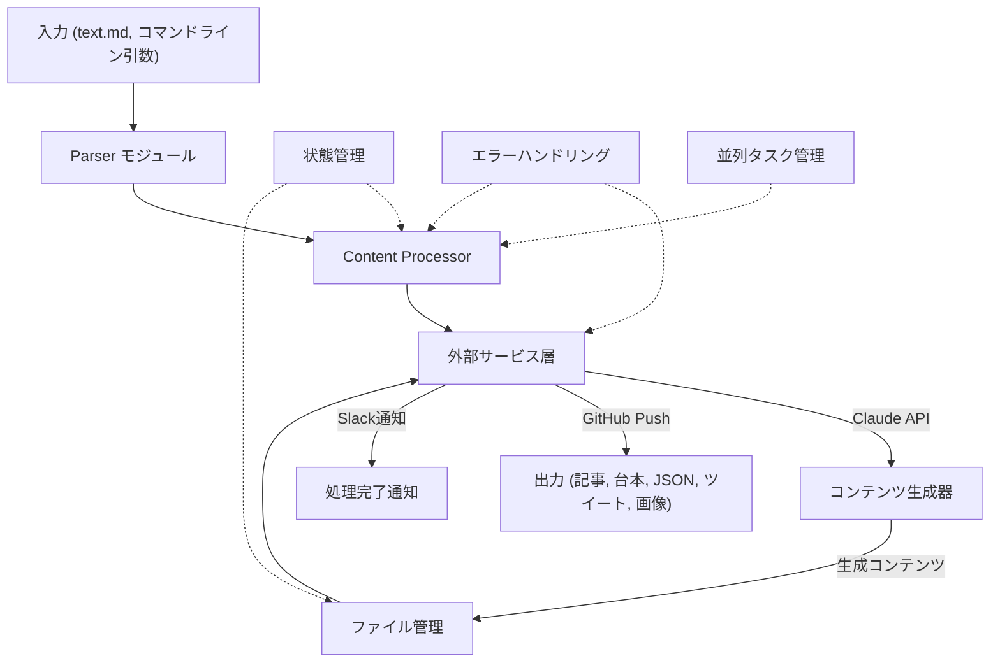
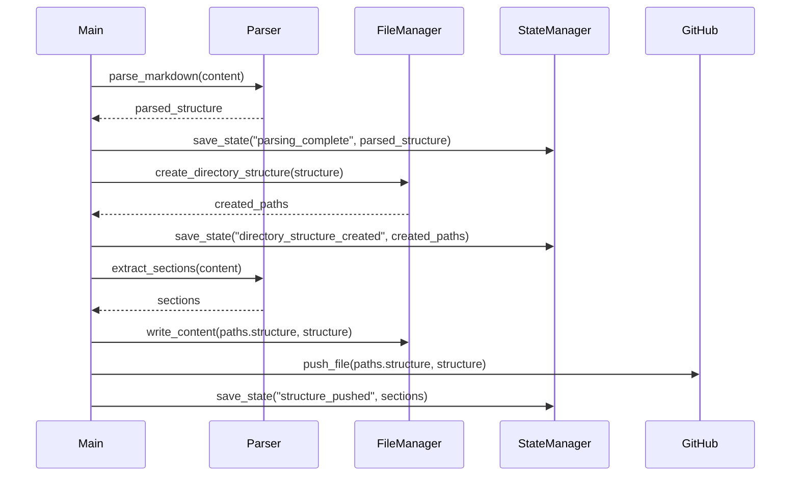
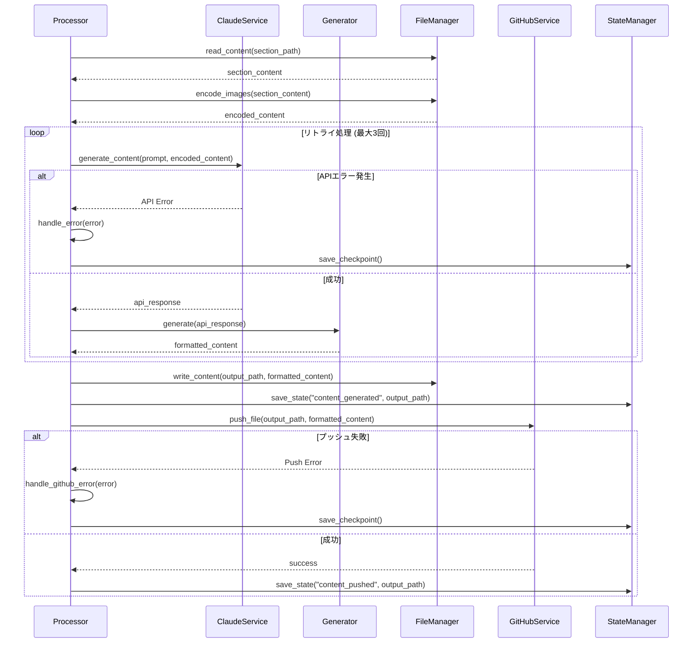
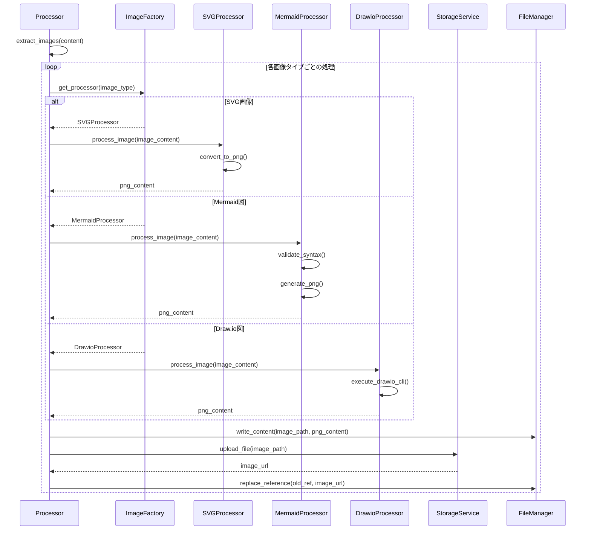
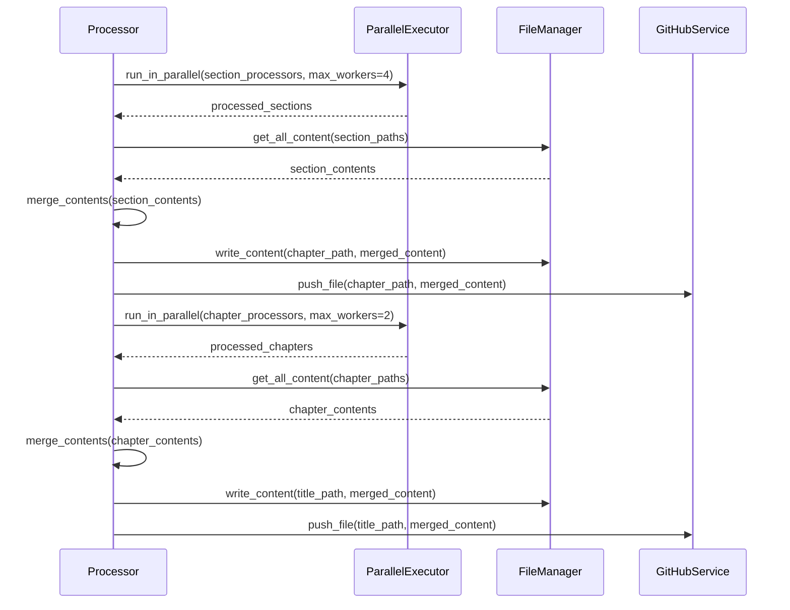

# オライリーコンテンツ変換プロジェクト アーキテクチャ設計（改訂版）

## 1. プロジェクト概要

このプロジェクトは、オライリーの長文記事（Markdown形式）を入力とし、Claude APIを利用して複数のコンテンツ形式（記事、動画台本、ツイートなど）を生成し、GitHubリポジトリに段階的にpushするPythonアプリケーションです。

## 2. アーキテクチャ概要図



## 3. フォルダ構造

```
resource_generate_workflow/
├── main.py                     # エントリーポイント
├── requirements.txt            # 依存パッケージ
│
├── config/
│   ├── settings.py             # 全体設定
│   ├── credentials.py          # API認証情報
│
├── core/
│   ├── parser.py               # Markdown・YAML解析の抽象ロジック
│   ├── processor.py            # コンテンツ処理の抽象基底クラス
│   ├── file_manager.py         # ファイル操作
│   ├── content_generator.py    # コンテンツ生成の抽象基底クラス
│   └── state_manager.py        # 処理状態の管理
│
├── services/                   # 外部サービス連携の抽象ロジック
│   ├── client.py               # APIクライアント基底クラス
│   ├── claude.py               # Claude API実装
│   ├── github.py               # GitHub API実装
│   ├── storage.py              # S3ストレージ実装
│   └── notifier.py             # Slack通知実装
│
├── generators/                 # 具体的なコンテンツ生成器
│   ├── article.py              # 記事生成
│   ├── script.py               # 台本生成
│   ├── json_script.py          # JSONスクリプト生成
│   ├── tweets.py               # ツイート生成
│   ├── description.py          # 概要生成
│   ├── structure.py            # セクション構造YAML生成
│   └── image/                  # 画像処理・生成
│       ├── processor.py        # 画像処理基底クラス
│       ├── svg_processor.py    # SVG画像の処理
│       ├── mermaid_processor.py # Mermaid図の処理
│       └── drawio_processor.py # Draw.io XML図の処理
│
├── templates/                  # プロンプトテンプレート
│   └── prompts/
│       ├── section_structure.yml
│       ├── article.md
│       ├── script.md
│       ├── script_json.md
│       ├── tweets.md
│       ├── description.md
│       └── structure.md        # セクション構造生成用プロンプト
│   └── description_template.md          # 概要テンプレート
│
├── utils/
│   ├── logging.py              # ロギング
│   ├── helpers.py              # 汎用ヘルパー関数
│   ├── exceptions.py           # カスタム例外クラス
│   ├── retry.py                # リトライメカニズム
│   └── parallel.py             # 並列処理ユーティリティ
│
└── tests/                      # テスト
    └── fixtures/               # テスト用データ
```

## 4. 主要モジュールの役割と設計パターン

### 4.1 抽象層（core/）

#### parser.py
- **責務**: Markdownやその他の形式の解析を抽象化
- **設計**: Strategy パターンを使用し、異なる解析戦略を切り替え可能
- **主要機能**:
  - `parse_markdown(content)`: Markdownを解析し構造化データに変換
  - `extract_sections(content)`: 章・セクション情報を抽出
  - `extract_images(content)`: 画像参照を抽出

#### processor.py
- **責務**: コンテンツ処理のワークフロー定義
- **設計**: Template Method パターンで処理フローを標準化
- **主要機能**:
  - `process()`: 処理全体を制御するテンプレートメソッド
  - `pre_process()`: 前処理（派生クラスでオーバーライド）
  - `execute()`: 主処理（派生クラスでオーバーライド）
  - `post_process()`: 後処理（派生クラスでオーバーライド）
  - `handle_error(error)`: エラー処理と復旧ロジック
  - `save_checkpoint()`: 処理状態のチェックポイント保存

#### file_manager.py
- **責務**: ファイル/ディレクトリの操作を抽象化
- **設計**: Facade パターンでファイル操作を簡略化
- **主要機能**:
  - `create_directory_structure(base_path, structure)`: ディレクトリ構造作成
  - `write_content(path, content)`: コンテンツ書き込み
  - `read_content(path)`: コンテンツ読み込み
  - `encode_images(content)`: 画像をBase64エンコード
  - `cache_content(key, content)`: 処理結果の一時キャッシュ
  - `get_cached_content(key)`: キャッシュからの取得

#### content_generator.py
- **責務**: 様々なコンテンツ生成の基底クラス
- **設計**: Factory Method パターン
- **主要機能**:
  - `generate(input_data)`: コンテンツ生成の基底メソッド
  - `format_output(raw_content)`: 出力形式のフォーマット
  - `validate_content(content)`: 生成内容の検証
  - `optimize_prompt(template, context)`: プロンプト最適化

#### state_manager.py
- **責務**: 処理状態の管理とチェックポイント
- **設計**: Memento パターンで状態保存と復元
- **主要機能**:
  - `save_state(process_id, state_data)`: 処理状態の保存
  - `load_state(process_id)`: 処理状態の読み込み
  - `list_checkpoints()`: 利用可能なチェックポイント一覧取得
  - `resume_from_checkpoint(checkpoint_id)`: チェックポイントからの再開
  - `cleanup_old_checkpoints(days=7)`: 古いチェックポイントの削除

### 4.2 サービス層（services/）

#### client.py
- **責務**: 外部APIと通信する基底クラス
- **設計**: Adapter パターンで外部インターフェースを統一
- **主要機能**:
  - `request(endpoint, payload)`: API通信の抽象化
  - `handle_response(response)`: レスポンス処理
  - `handle_error(error)`: エラー処理
  - `retry_request(max_attempts=3)`: 失敗時の自動リトライ装飾子

#### claude.py
- **責務**: Claude APIとの通信
- **設計**: clientの具象実装
- **主要機能**:
  - `generate_content(prompt, images)`: プロンプトとイメージからコンテンツ生成
  - `extract_yaml(response)`: YAMLコンテンツの抽出
  - `extract_markdown(response)`: Markdownコンテンツの抽出
  - `handle_rate_limit()`: レート制限対応
  - `validate_response(response)`: 応答検証

#### github.py
- **責務**: GitHubリポジトリ操作
- **設計**: clientの具象実装
- **主要機能**:
  - `push_file(path, content)`: ファイルのpush
  - `create_branch(branch_name)`: ブランチ作成
  - `create_commit(message, files)`: コミット作成
  - `handle_conflict()`: コンフリクト解決
  - `verify_push_success()`: プッシュ成功の検証

#### storage.py
- **責務**: 画像ファイルのS3ストレージ操作
- **設計**: clientの具象実装
- **主要機能**:
  - `upload_file(file_path, remote_path)`: ファイルアップロード
  - `get_url(remote_path)`: ファイルのURL取得
  - `delete_file(remote_path)`: ファイル削除
  - `check_upload_status(upload_id)`: アップロード状態確認

#### notifier.py
- **責務**: Slack通知送信
- **設計**: clientの具象実装
- **主要機能**:
  - `send_success(message)`: 成功通知送信
  - `send_error(error_message)`: エラー通知送信
  - `send_progress(status, percentage)`: 進捗通知送信
  - `send_checkpoint_notification(checkpoint_id)`: チェックポイント作成通知

### 4.3 生成器（generators/）

各ファイルは`content_generator.py`を継承し、特定タイプのコンテンツ生成を担当します。

#### article.py
- 記事（article.md）の生成ロジック
- Claude APIプロンプトの構築
- 画像参照の処理
- 長文コンテンツのチャンク分割と再結合

#### script.py
- 動画台本（script.md）の生成ロジック
- 台本フォーマット処理
- 台詞とト書きの適切な構造化

#### json_script.py
- 台本JSON（script.json）の生成ロジック
- JSON構造の検証
- タイムコード・キュー情報の追加

#### tweets.py
- ツイート集（tweets.csv）の生成ロジック
- CSVフォーマット処理
- ツイート長の検証と調整

#### structure.py
- セクション構造（section_structure.yaml）の生成ロジック
- YAMLフォーマット処理と検証
- パラグラフ構造と学習目標の定義
- コンテンツシーケンスの設計

#### image/processor.py
- 画像処理の基底クラス
- ファイル形式検出
- 適切なプロセッサへの委譲

#### image/svg_processor.py
- SVG画像のPNG変換
- SVGの最適化
- 変換エラーの対応

#### image/mermaid_processor.py
- Mermaid図のPNG変換
- mermaid-cliツールの検証と実行
- 変換設定の最適化

#### image/drawio_processor.py
- Draw.io XML図のPNG変換
- draw.ioコマンドラインツールの検証と実行
- ファイル形式の適切な変換

### 4.4 エラーハンドリングとリトライ（utils/retry.py）

- **責務**: API呼び出しなどの失敗時のリトライロジック
- **設計**: Decorator パターンでリトライを実装
- **主要機能**:
  - `retry_on_exception(max_attempts, exceptions, backoff_factor)`: 例外発生時のリトライ装飾子
  - `retry_on_result(max_attempts, validate_result)`: 結果検証失敗時のリトライ装飾子
  - `exponential_backoff(attempt, factor)`: 指数バックオフ計算
  - `circuit_breaker(failure_threshold)`: 連続失敗時の回路遮断

### 4.5 並列処理（utils/parallel.py）

- **責務**: 並列タスク実行の抽象化
- **設計**: Worker Pool パターン
- **主要機能**:
  - `ParallelExecutor`: タスク並列実行クラス
  - `task_group(max_workers)`: タスクグループコンテキストマネージャ
  - `run_in_parallel(tasks, max_workers)`: 複数タスクの並列実行
  - `chunk_processor(items, processor_func, chunks)`: アイテムの分割処理

## 5. 処理フロー詳細

### 5.1 初期化フェーズ

```python
# main.pyでの処理フロー例
def main():
    # 引数解析
    args = parse_arguments()
    
    # 設定読み込み
    config = load_config()
    
    # 前回のチェックポイントがあれば状態復元の提案
    state_manager = StateManager()
    checkpoints = state_manager.list_checkpoints_for_title(args.title)
    if checkpoints and args.resume is None:
        print(f"{len(checkpoints)}個のチェックポイントが見つかりました。再開する場合は --resume オプションを指定してください。")
        for idx, cp in enumerate(checkpoints):
            print(f"  {idx}: {cp.timestamp} - {cp.description}")
        return
        
    # サービスインスタンス化
    claude_service = ClaudeService(config)
    github_service = GitHubService(config)
    storage_service = StorageService(config)
    notifier = NotifierService(config)
    
    # ファイル管理
    file_manager = FileManager()
    
    # メイン処理実行
    try:
        # 処理状態の復元または新規作成
        if args.resume:
            processor = state_manager.resume_process(args.resume)
            notifier.send_progress(f"{args.title}の処理を再開します。", processor.progress_percentage)
        else:
            # 原稿読み込み
            content = file_manager.read_content(args.input_path)
            processor = ContentProcessor(content, args, file_manager, claude_service, 
                                        github_service, storage_service, state_manager)
        
        # 処理開始
        processor.process()
        
        # 完了通知
        notifier.send_success(f"{args.title}の処理が完了しました")
    except Exception as e:
        # エラー発生時はチェックポイントを自動作成
        checkpoint_id = processor.save_checkpoint()
        
        # エラー通知
        notifier.send_error(f"エラー発生: {str(e)}",
                           f"チェックポイント {checkpoint_id} が作成されました。--resume {checkpoint_id} で再開できます。")
```

### 5.2 階層構造解析フェーズ（ステート管理対応）



### 5.3 コンテンツ生成フェーズ（エラーハンドリング対応）



### 5.4 画像処理フェーズ（詳細化）



### 5.5 コンテンツ統合フェーズ（並列処理対応）



## 6. 拡張性と保守性の考慮

### 6.1 拡張ポイント

1. **新コンテンツタイプの追加**
   - `generators/`に新しい生成器クラスを追加
   - `templates/`に対応するテンプレートを追加

2. **新サービスの統合**
   - `services/`に新しいサービスクラスを追加
   - `client.py`の抽象インターフェースを実装

3. **処理フローの変更**
   - `processor.py`のテンプレートメソッドをオーバーライド
   - 新しいプロセッサクラスを追加

4. **新しい画像処理タイプの追加**
   - `generators/image/`に新しいプロセッサを追加
   - `ImageFactory`に新しいタイプを登録

### 6.2 依存性注入

- 各コンポーネントは必要なサービスを外部から注入
- テストの容易さと柔軟性を確保

### 6.3 エラーハンドリングとリカバリ戦略

1. **階層的な例外クラス構造**
   ```
   AppException
   ├── APIException
   │   ├── ClaudeAPIException
   │   ├── GitHubAPIException
   │   └── StorageAPIException
   ├── ProcessingException
   │   ├── ParsingException
   │   ├── GenerationException
   │   └── ImageProcessingException
   └── ConfigurationException
   ```

2. **リトライ戦略**
   - 単純リトライ: 即時再試行
   - 指数バックオフ: 遅延を増加させながら再試行
   - サーキットブレーカー: 連続失敗時に一時停止

3. **チェックポイントと再開メカニズム**
   - 各主要ステップでの状態保存
   - エラー発生時の自動チェックポイント生成
   - コマンドライン引数による再開機能

### 6.4 パフォーマンス最適化

1. **並列処理**
   - セクション・章の並列処理
   - 画像変換の並列実行
   - タスク数に応じた動的ワーカー調整

2. **リソース管理**
   - メモリ効率のためのストリーム処理
   - 一時ファイルの適切なクリーンアップ
   - 長時間タスクの進捗モニタリング

## 7. デプロイメントと実行

1. **環境セットアップ**
   ```bash
   pip install -r requirements.txt
   ```

2. **外部依存のインストール**
   ```bash
   # Mermaid CLI
   npm install -g @mermaid-js/mermaid-cli
   
   # Draw.io CLI
   # 各OSに応じたインストール手順に従う
   ```

3. **設定ファイル準備**
   ```
   config/credentials.py に必要なAPI keyを設定
   ```

4. **実行**
   ```bash
   # 新規処理開始
   python main.py --lang go --title "タイトル名"
   
   # チェックポイントから再開
   python main.py --lang go --title "タイトル名" --resume checkpoint_id
   ```

5. **進捗モニタリング**
   - Slack通知による進捗確認
   - ログファイルによる詳細追跡

## 8. テスト戦略

1. **ユニットテスト**
   - 各モジュールの独立したテスト
   - モックを利用した外部依存の分離

2. **統合テスト**
   - 複数モジュールの連携テスト
   - 主要処理フローの検証

3. **エラー条件テスト**
   - 外部サービス障害時の動作検証
   - リトライ・リカバリメカニズムの検証

4. **並列処理テスト**
   - 複数タスクの同時実行テスト
   - リソース競合時の挙動検証