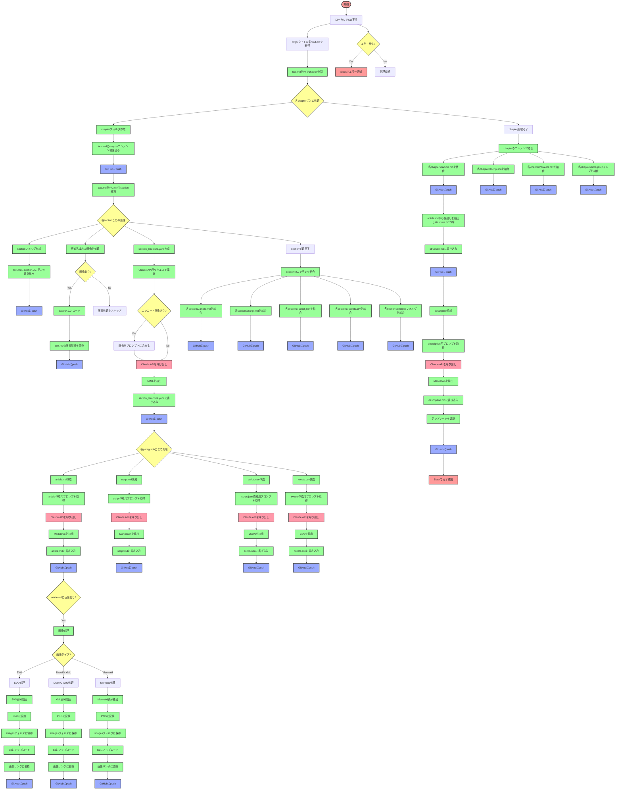

```mermaid
graph TB
    %% メインプロセス
    Start([開始]) --> RunScript[ローカルでCLI実行]
    RunScript --> FetchSource[til/go/タイトル名/text.mdを取得]
    FetchSource --> SplitChapters[text.mdを##でchapter分割]
    
    %% Chapter処理ループ
    SplitChapters --> ChapterLoop{各chapterごとの処理}
    ChapterLoop --> CreateChapterFolder[chapterフォルダ作成]
    CreateChapterFolder --> WriteChapterContent[text.mdにchapterコンテンツ書き込み]
    WriteChapterContent --> GitHubPushChapter[GitHubにpush]
    GitHubPushChapter --> SplitSections[text.mdを##, ###でsection分割]
    
    %% Section処理ループ
    SplitSections --> SectionLoop{各sectionごとの処理}
    SectionLoop --> CreateSectionFolder[sectionフォルダ作成]
    CreateSectionFolder --> WriteSectionContent[text.mdにsectionコンテンツ書き込み]
    WriteSectionContent --> GitHubPushSection[GitHubにpush]
    
    %% 画像処理フロー
    SectionLoop --> ProcessImages[埋め込まれた画像を処理]
    ProcessImages --> CheckHasImages{画像あり?}
    CheckHasImages -->|Yes| EncodeImages[Base64エンコード]
    EncodeImages --> ReplaceImageInMd[text.mdの画像部分を置換]
    ReplaceImageInMd --> GitHubPushEncodedImg[GitHubにpush]
    CheckHasImages -->|No| SkipImageProcess[画像処理をスキップ]
    
    %% 段落構造作成
    SectionLoop --> CreateStructure[section_structure.yaml作成]
    CreateStructure --> PrepareClaudeReq[Claude API用リクエスト準備]
    PrepareClaudeReq --> CheckEncodedImages{エンコード画像あり?}
    CheckEncodedImages -->|Yes| IncludeImagesInPrompt[画像をプロンプトに含める]
    IncludeImagesInPrompt --> CallClaudeApi1[Claude APIを呼び出し]
    CheckEncodedImages -->|No| CallClaudeApi1
    CallClaudeApi1 --> ExtractYaml[YAMLを抽出]
    ExtractYaml --> WriteStructureYaml[section_structure.yamlに書き込み]
    WriteStructureYaml --> GitHubPushStructure[GitHubにpush]
    
    %% Paragraph処理ループ
    GitHubPushStructure --> ParagraphLoop{各paragraphごとの処理}
    
    %% 記事生成
    ParagraphLoop --> CreateArticle[article.md作成]
    CreateArticle --> GetArticlePrompt[article作成用プロンプト取得]
    GetArticlePrompt --> CallClaudeApi2[Claude APIを呼び出し]
    CallClaudeApi2 --> ExtractArticleMd[Markdownを抽出]
    ExtractArticleMd --> WriteArticleMd[article.mdに書き込み]
    WriteArticleMd --> GitHubPushArticle[GitHubにpush]
    
    %% 画像変換処理
    GitHubPushArticle --> CheckArticleImages{article.mdに画像あり?}
    CheckArticleImages -->|Yes| ProcessArticleImages[画像処理]
    ProcessArticleImages --> CheckImageType{画像タイプ?}
    CheckImageType -->|SVG| ProcessSvg[SVG処理]
    CheckImageType -->|DrawIO XML| ProcessDrawIO[DrawIO XML処理]
    CheckImageType -->|Mermaid| ProcessMermaid[Mermaid処理]
    
    %% SVG処理
    ProcessSvg --> ExtractSvg[SVG部分抽出]
    ExtractSvg --> ConvertSvgToPng[PNGに変換]
    ConvertSvgToPng --> SaveToImagesFolder1[imagesフォルダに保存]
    SaveToImagesFolder1 --> UploadToS31[S3にアップロード]
    UploadToS31 --> ReplaceWithLink1[画像リンクに置換]
    ReplaceWithLink1 --> GitHubPushImgProcessed1[GitHubにpush]
    
    %% DrawIO処理
    ProcessDrawIO --> ExtractXml[XML部分抽出]
    ExtractXml --> ConvertXmlToPng[PNGに変換]
    ConvertXmlToPng --> SaveToImagesFolder2[imagesフォルダに保存]
    SaveToImagesFolder2 --> UploadToS32[S3にアップロード]
    UploadToS32 --> ReplaceWithLink2[画像リンクに置換]
    ReplaceWithLink2 --> GitHubPushImgProcessed2[GitHubにpush]
    
    %% Mermaid処理
    ProcessMermaid --> ExtractMermaid[Mermaid部分抽出]
    ExtractMermaid --> ConvertMermaidToPng[PNGに変換]
    ConvertMermaidToPng --> SaveToImagesFolder3[imagesフォルダに保存]
    SaveToImagesFolder3 --> UploadToS33[S3にアップロード]
    UploadToS33 --> ReplaceWithLink3[画像リンクに置換]
    ReplaceWithLink3 --> GitHubPushImgProcessed3[GitHubにpush]
    
    %% 台本作成
    ParagraphLoop --> CreateScript[script.md作成]
    CreateScript --> GetScriptPrompt[script作成用プロンプト取得]
    GetScriptPrompt --> CallClaudeApi3[Claude APIを呼び出し]
    CallClaudeApi3 --> ExtractScriptMd[Markdownを抽出]
    ExtractScriptMd --> WriteScriptMd[script.mdに書き込み]
    WriteScriptMd --> GitHubPushScript[GitHubにpush]
    
    %% 台本JSON作成
    ParagraphLoop --> CreateScriptJson[script.json作成]
    CreateScriptJson --> GetScriptJsonPrompt[script.json作成用プロンプト取得]
    GetScriptJsonPrompt --> CallClaudeApi4[Claude APIを呼び出し]
    CallClaudeApi4 --> ExtractScriptJson[JSONを抽出]
    ExtractScriptJson --> WriteScriptJson[script.jsonに書き込み]
    WriteScriptJson --> GitHubPushScriptJson[GitHubにpush]
    
    %% ツイート作成
    ParagraphLoop --> CreateTweets[tweets.csv作成]
    CreateTweets --> GetTweetsPrompt[tweets作成用プロンプト取得]
    GetTweetsPrompt --> CallClaudeApi5[Claude APIを呼び出し]
    CallClaudeApi5 --> ExtractTweetsCsv[CSVを抽出]
    ExtractTweetsCsv --> WriteTweetsCsv[tweets.csvに書き込み]
    WriteTweetsCsv --> GitHubPushTweets[GitHubにpush]
    
    %% Sectionのコンテンツ結合
    SectionLoop --> EndSectionProcess[section処理完了]
    EndSectionProcess --> CombineSectionContents[sectionのコンテンツ結合]
    
    %% Combined files
    CombineSectionContents --> CombineSectionArticles[各sectionのarticle.mdを結合]
    CombineSectionContents --> CombineSectionScripts[各sectionのscript.mdを結合]
    CombineSectionContents --> CombineSectionScriptJSONs[各sectionのscript.jsonを結合]
    CombineSectionContents --> CombineSectionTweets[各sectionのtweets.csvを結合]
    CombineSectionContents --> CombineSectionImages[各sectionのimagesフォルダを結合]
    
    %% GitHub Push
    CombineSectionArticles --> GitHubPushCombinedArticle[GitHubにpush]
    CombineSectionScripts --> GitHubPushCombinedScript[GitHubにpush]
    CombineSectionScriptJSONs --> GitHubPushCombinedJson[GitHubにpush]
    CombineSectionTweets --> GitHubPushCombinedTweets[GitHubにpush]
    CombineSectionImages --> GitHubPushCombinedImages[GitHubにpush]
    
    %% Chapterのコンテンツ結合
    ChapterLoop --> EndChapterProcess[chapter処理完了]
    EndChapterProcess --> CombineChapterContents[chapterのコンテンツ結合]
    
    %% Combined files at title level
    CombineChapterContents --> CombineChapterArticles[各chapterのarticle.mdを結合]
    CombineChapterContents --> CombineChapterScripts[各chapterのscript.mdを結合]
    CombineChapterContents --> CombineChapterTweets[各chapterのtweets.csvを結合]
    CombineChapterContents --> CombineChapterImages[各chapterのimagesフォルダを結合]
    
    %% GitHub Push 
    CombineChapterArticles --> GitHubPushTitleArticle[GitHubにpush]
    CombineChapterScripts --> GitHubPushTitleScript[GitHubにpush]
    CombineChapterTweets --> GitHubPushTitleTweets[GitHubにpush]
    CombineChapterImages --> GitHubPushTitleImages[GitHubにpush]
    
    %% 構造ファイル作成
    GitHubPushTitleArticle --> CreateStructureMd[article.mdから見出しを抽出しstructure.md作成]
    CreateStructureMd --> WriteStructureMd[structure.mdに書き込み]
    WriteStructureMd --> GitHubPushStructureMd[GitHubにpush]
    
    %% Description作成
    GitHubPushStructureMd --> CreateDescription[description作成]
    CreateDescription --> GetDescriptionPrompt[description用プロンプト取得]
    GetDescriptionPrompt --> CallClaudeApi6[Claude APIを呼び出し]
    CallClaudeApi6 --> ExtractDescriptionMd[Markdownを抽出]
    ExtractDescriptionMd --> WriteDescriptionMd[description.mdに書き込み]
    WriteDescriptionMd --> AppendTemplateContent[テンプレートを追記]
    AppendTemplateContent --> GitHubPushDescription[GitHubにpush]
    
    %% 完了通知
    GitHubPushDescription --> NotifySlack[Slackで完了通知]
    
    %% エラー処理
    RunScript --> ErrorHandler{エラー発生?}
    ErrorHandler -->|Yes| NotifySlackError[Slackでエラー通知]
    ErrorHandler -->|No| ContinueProcess[処理継続]
    
    %% スタイル
    classDef api fill:#f9a,stroke:#333,stroke-width:2px;
    classDef github fill:#9af,stroke:#333,stroke-width:2px;
    classDef process fill:#9f9,stroke:#333,stroke-width:2px;
    classDef decision fill:#ff9,stroke:#333,stroke-width:2px;
    classDef start fill:#f99,stroke:#333,stroke-width:2px;
    
    class CallClaudeApi1,CallClaudeApi2,CallClaudeApi3,CallClaudeApi4,CallClaudeApi5,CallClaudeApi6 api;
    class GitHubPushChapter,GitHubPushSection,GitHubPushEncodedImg,GitHubPushStructure,GitHubPushArticle,GitHubPushImgProcessed1,GitHubPushImgProcessed2,GitHubPushImgProcessed3,GitHubPushScript,GitHubPushScriptJson,GitHubPushTweets,GitHubPushCombinedArticle,GitHubPushCombinedScript,GitHubPushCombinedJson,GitHubPushCombinedTweets,GitHubPushCombinedImages,GitHubPushTitleArticle,GitHubPushTitleScript,GitHubPushTitleTweets,GitHubPushTitleImages,GitHubPushStructureMd,GitHubPushDescription github;
    class SplitChapters,CreateChapterFolder,WriteChapterContent,SplitSections,CreateSectionFolder,WriteSectionContent,ProcessImages,EncodeImages,ReplaceImageInMd,CreateStructure,PrepareClaudeReq,ExtractYaml,WriteStructureYaml,CreateArticle,GetArticlePrompt,ExtractArticleMd,WriteArticleMd,ProcessArticleImages,ExtractSvg,ConvertSvgToPng,SaveToImagesFolder1,UploadToS31,ReplaceWithLink1,ExtractXml,ConvertXmlToPng,SaveToImagesFolder2,UploadToS32,ReplaceWithLink2,ExtractMermaid,ConvertMermaidToPng,SaveToImagesFolder3,UploadToS33,ReplaceWithLink3,CreateScript,GetScriptPrompt,ExtractScriptMd,WriteScriptMd,CreateScriptJson,GetScriptJsonPrompt,ExtractScriptJson,WriteScriptJson,CreateTweets,GetTweetsPrompt,ExtractTweetsCsv,WriteTweetsCsv,CombineSectionContents,CombineSectionArticles,CombineSectionScripts,CombineSectionScriptJSONs,CombineSectionTweets,CombineSectionImages,CombineChapterContents,CombineChapterArticles,CombineChapterScripts,CombineChapterTweets,CombineChapterImages,CreateStructureMd,WriteStructureMd,CreateDescription,GetDescriptionPrompt,ExtractDescriptionMd,WriteDescriptionMd,AppendTemplateContent process;
    class ChapterLoop,SectionLoop,CheckHasImages,CheckEncodedImages,ParagraphLoop,CheckArticleImages,CheckImageType,ErrorHandler decision;
    class Start,NotifySlack,NotifySlackError start;
```