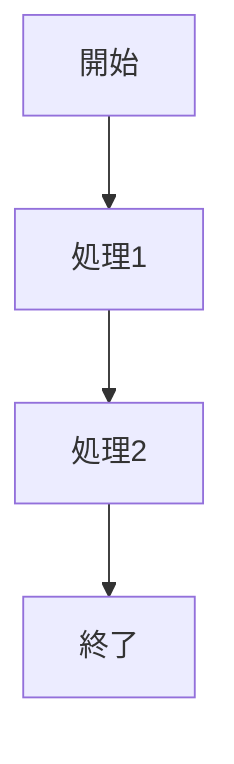

# テスト用サンプルコンテンツ

このファイルはテスト用のサンプルMarkdownコンテンツです。章とセクションで構成されています。

## 第1章: はじめに

この章では基本的な概念について説明します。

### 1.1 基本概念

基本的な概念は以下の通りです：

- 項目1
- 項目2
- 項目3

### 1.2 重要な考え方

重要な考え方について説明します。



## 第2章: 実践編

この章では実践的な内容を説明します。

### 2.1 具体的な実装

具体的な実装方法を示します。

```python
def sample_function():
    print("これはサンプル関数です")
    return True
```

### 2.2 応用例

応用例として、以下のような図があります。


### 2.3 SVGの例

```svg
<svg width="100" height="100">
  <circle cx="50" cy="50" r="40" stroke="black" stroke-width="2" fill="red" />
</svg>
```

## 第3章: まとめ

この章ではこれまでの内容をまとめます。

### 3.1 総括

学んだことのまとめです。

### 3.2 次のステップ

次のステップとして以下のことを推奨します：

1. 実践的な練習
2. 応用事例の研究
3. 最新情報のキャッチアップ 